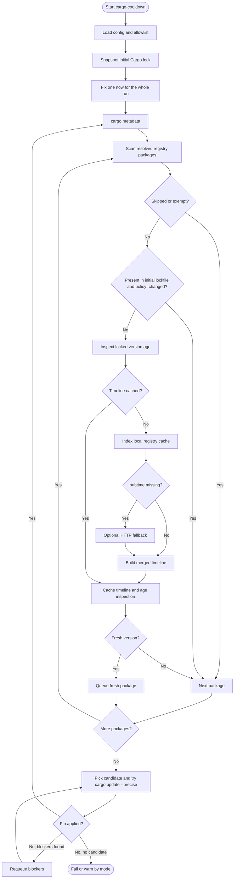

# How Resolution Works Today

`cargo-cooldown` runs as an outer Cargo loop.

It keeps Cargo as the source of truth for the resolved graph, but avoids
re-reading the same registry metadata inside one cooldown execution.

## 1. Execution boundary

At the beginning of one `cargo-cooldown` execution, the resolver:

1. loads config and allowlist rules;
2. snapshots the initial `Cargo.lock` once;
3. fixes a single `now` timestamp for the whole run;
4. creates one registry store that lives across every pin attempt in that run.

That boundary matters because the current implementation already caches:

- registry contexts by source ID;
- release timelines in memory by `(source_id, crate_name)`;
- locked-version age inspections by `(source_id, crate_name, current_version, minimum_minutes)`.

So even though Cargo is re-run after each successful pin, the resolver does not
need to rebuild the same registry timeline or re-evaluate the same locked
version more than once inside the same process, and it does not recalculate the
initial lockfile baseline after later pins.

If any later cooldown step fails after Cargo has already rewritten `Cargo.lock`,
the resolver restores the exact lockfile contents that were present at process
start before returning the error.

## 2. Graph scan and release-age inspection

On each outer pass, `cargo-cooldown` runs `cargo metadata` and rebuilds the
current resolved graph.

For each registry package in that graph:

1. resolve the effective registry location from Cargo's own configuration;
2. skip the package immediately if its registry is in `skip_registries`;
3. skip the package if it is exact-allowlisted or its effective cooldown is `0`;
4. if `lockfile_policy = "changed"`, skip the package when the exact locked
   `(registry, crate, version)` was already present in the initial lockfile
   baseline;
5. inspect the locked version age.

The age inspection itself works like this:

1. load the crate timeline from the in-memory cache if it is already known;
2. otherwise read the local registry index cache for that crate;
3. use `pubtime` as the authoritative timestamp when it is present;
4. if `pubtime` is missing, attempt one fallback HTTP request for that crate;
5. merge the local index data and fallback data into one release timeline;
6. cache that timeline in memory for the rest of the run;
7. cache the age result for the locked version so the same version is not
   re-inspected after later pins.

If a package is not skipped and still lacks a usable timestamp after local
index plus fallback, the cooldown step fails in `enforce` mode and becomes a
warning in `warn` mode.

## 3. Candidate selection and pin loop

For each non-skipped package whose locked version is younger than the cooldown
cutoff:

1. collect all `VersionReq` constraints observed in the resolved graph;
2. walk the timeline from newest to oldest;
3. pick the first release that:
   - is not yanked;
   - is older than the cutoff;
   - is lower than the locked version;
   - satisfies every observed requirement.

Fresh packages are queued and pinned one at a time with `cargo update --precise`.

If Cargo rejects a pin because another package blocks it, the blocker is queued
and the resolver keeps working inside that same pass. If a pin succeeds, the
resolver restarts from `cargo metadata` so Cargo can re-resolve the graph from
the new lockfile state. The initial baseline does not change, so any package
that moves to a version not present in that baseline becomes eligible for
cooldown on the next pass.

That is the main remaining cost today: the resolved graph is still rebuilt after
each successful pin, even though the registry timelines and many locked-version
inspections are already cached.

## Next optimization level

The next step is more complex: stop rescanning the whole resolved graph after
every successful pin.

The efficient model is an incremental frontier:

1. keep the reverse dependency graph in memory;
2. after a pin, identify only the package IDs whose locked versions changed;
3. invalidate freshness and candidate state for those packages plus their
   reverse dependents;
4. recompute only that affected slice instead of rebuilding the full set of
   fresh packages from scratch.

That should reduce the repeated full-graph passes seen in large cooldown runs,
but it needs careful bookkeeping to avoid stale semver constraints and blocker
propagation bugs.
