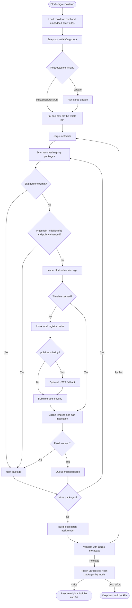

# Resolution Flow

This is the implementation reference. Start with
[Configuration](configuration.md) if you only need to choose settings.

`cargo-cooldown` runs as an outer Cargo loop.

It keeps Cargo as the source of truth for the resolved graph, but avoids
re-reading the same registry metadata inside one cooldown execution.

## 1. Execution boundary

At the beginning of one `cargo-cooldown` execution, the resolver:

1. loads config and embedded allow rules;
2. snapshots the initial `Cargo.lock` once;
3. if the requested command is `cargo cooldown update`, runs `cargo update`;
4. fixes a single `now` timestamp for the whole run;
5. creates one registry store that lives across every pin attempt in that run.

That snapshot is taken before any Cargo command is allowed to rewrite the
lockfile.

- for `cargo cooldown build|check|test|run`, the snapshot happens before
  `cargo metadata` and before any fallback `cargo generate-lockfile` when the
  lockfile is missing;
- for `cargo cooldown update`, the snapshot happens before `cargo update`, and
  the later cooldown pass evaluates the post-update lockfile against that
  pre-update baseline.

That boundary matters because the current implementation already caches:

- registry contexts by source ID;
- release timelines in memory by `(source_id, crate_name)`;
- locked-version age inspections by `(source_id, crate_name, current_version, minimum_minutes)`.

So even though Cargo is re-run after each successful pin, the resolver does not
need to rebuild the same registry timeline or re-evaluate the same locked
version more than once inside the same process, and it does not recalculate the
initial lockfile baseline after later pins.

If any later cooldown step fails after Cargo has already rewritten `Cargo.lock`,
the resolver restores the exact lockfile contents that were present at process
start before returning the error.

That means `cargo cooldown update` has this exact shape:

1. read and snapshot the current `Cargo.lock`;
2. run `cargo update`;
3. inspect the updated lockfile;
4. with `lockfile_policy = "changed"`, exempt any `(registry, crate, version)`
   that was already present in the original snapshot;
5. pin only the newly introduced or version-changed fresh entries, but allow
   them to return to an exact version from the original snapshot even if that
   baseline version is still fresher than the cutoff;
6. with `lockfile_policy = "changed"`, reject any cooldown assignment that would
   downgrade a package below the newest version of that package already present
   in the original snapshot;
7. if the cooldown step fails in `strict` mode, restore the original lockfile.

## 2. Graph scan and release-age inspection

On each outer pass, `cargo-cooldown` runs `cargo metadata` and rebuilds the
derived cooldown state from Cargo's current resolved graph.

For each registry package in the selected dependency closure:

1. resolve the effective registry location from Cargo's own configuration;
2. skip the package immediately if its registry is in `skip_registries`;
3. skip the package if it matches an exact allow rule or its effective cooldown
   is `0`;
4. if `lockfile_policy = "changed"`, skip the package when the exact locked
   `(registry, crate, version)` was already present in the initial lockfile
   baseline;
5. inspect the locked version age.

For `cargo cooldown update`, step 4 compares the updated lockfile against the
pre-update snapshot. So a version that was already in `Cargo.lock` before the
update remains exempt, while a version introduced by `cargo update` is eligible
for cooldown. If `cargo update` moves `foo 1.2.3` to `foo 1.2.4`, cooldown may
pin `foo` back to `1.2.3` even when `1.2.3` is still fresh, because that exact
version was already part of the baseline snapshot. With the default
`lockfile_policy = "changed"`, it will not pin `foo` below `1.2.3` during that
update run. With `lockfile_policy = "all"`, the pre-update snapshot is not an
exemption, so `foo` can be cooled below `1.2.3` when Cargo accepts the result.

The age inspection itself works like this:

1. load the crate timeline from the in-memory cache if it is already known;
2. otherwise read the local registry index cache for that crate;
3. use `pubtime` as the authoritative timestamp when it is present;
4. if `pubtime` is missing, attempt one fallback HTTP request for that crate;
5. merge the local index data and fallback data into one release timeline;
6. cache that timeline in memory for the rest of the run;
7. cache the age result for the locked version so the same version is not
   re-inspected after later pins.

If a package is not skipped and still lacks a usable timestamp after local
index plus fallback, the cooldown step fails in `strict` mode and becomes a
warning in `best_effort` mode.

## 3. Candidate selection and pin loop

For each non-skipped package whose locked version is younger than the cooldown
cutoff:

1. collect all `VersionReq` constraints observed in the resolved graph;
2. walk the timeline from newest to oldest;
3. pick the first release that:
   - is not yanked;
   - is lower than the locked version;
   - satisfies every observed requirement;
   - and is either older than the cutoff or already present in the initial
     lockfile baseline when `lockfile_policy = "changed"`.

Fresh packages are first considered for one bulk lockfile assignment. Cooldown
selects older candidates, builds local dependency components from registry
metadata, follows both dependencies and current reverse dependents that would be
broken by a lower version, and searches a bounded set of compatible
assignments. Local solver identities are `(registry, crate, current locked
version)`, and candidate dependencies are mapped through Cargo's current
resolved `PackageId` graph before falling back to semver matching. That lets
components include multiple locked versions of the same crate, such as
`getrandom 0.2` and `getrandom 0.3`, without conflating their constraints. It
then rewrites those package entries in `Cargo.lock` and asks Cargo to validate
the result. The fast validation starts with a locked metadata pass; if Cargo
only needs to refresh lockfile dependency entries, cooldown allows one normal
metadata pass and then checks the result with locked metadata again. If Cargo
rejects the batch, cooldown restores the previous lockfile and prunes the
reported blockers. The retry budget grows logarithmically with batch size and
stops early for broad batches where each rejection removes too little of the
candidate set to converge cheaply.

If Cargo rejects a pin because another package blocks it, the blocker is queued
and the resolver keeps working inside that same pass.

Two details matter here:

- the same `(registry, crate, version)` is not retried more than once in a
  single lockfile pass, because the lockfile has not changed yet and a second
  attempt would be redundant;
- if the only remaining blockers are outside the selected cooldown scope,
  protected by the initial lockfile baseline, already exhausted earlier in the
  run, or otherwise cooldown-exempt, the resolver keeps the currently
  locked version, emits a warning, and continues cooling the rest of the graph.

If a batch succeeds, the resolver restarts from `cargo metadata` so Cargo can
re-resolve the graph from the new lockfile state. Best-effort skips stay tied to
the exact `(registry, crate, version)` that was skipped, so the same fresh
version is not requeued again through blocker propagation after a restart. The
initial baseline does not change, so any package that moves to a version not
present in that baseline becomes eligible for cooldown on the next pass.

If a pass makes no successful pins but does record new best-effort skips, the
resolver also restarts from `cargo metadata` once so those skipped versions are
left out of the next freshness queue instead of ending in a generic fixed-point
error immediately.

Before giving up on the remaining best-effort set, cooldown runs one more
bounded pass for small resolver-constrained bundles linked by exact version
requirements. It searches a small set of mutually compatible older versions
using local index dependency metadata, rewrites that bundle in `Cargo.lock` as
one coordinated candidate state, and asks Cargo to validate the result. This
helps for tightly coupled stacks such as `js-sys` / `wasm-bindgen*` / `web-sys`,
where no single-package downgrade can make progress from the current lockfile
but a coordinated older bundle is still valid.

At the end of the run, cooldown emits one user-facing summary block. For cooled
packages, it renders Cargo-style lines from the initial `Cargo.lock` version to
the final frozen version, and appends `(latest: ...)` when the run first moved
through a fresher version. If fresh versions still remain it also distinguishes
between:

- versions that were already present in the initial `Cargo.lock` baseline; and
- versions that the resolver had to keep fresh because no further compatible
  cooldown pin was possible in this run.

That final distinction also drives the mode policy:

- `strict` fails if any resolver-constrained fresh versions remain and restores
  the original lockfile
- `best_effort` keeps the resulting lockfile and prints one warning block with
  those remaining fresh versions

The main scalability goal of the batch solver is to avoid one Cargo resolver
invocation per independent fresh crate. The bulk path handles the common case
where many packages can be cooled together while keeping Cargo as the final
validator for the resulting graph.
